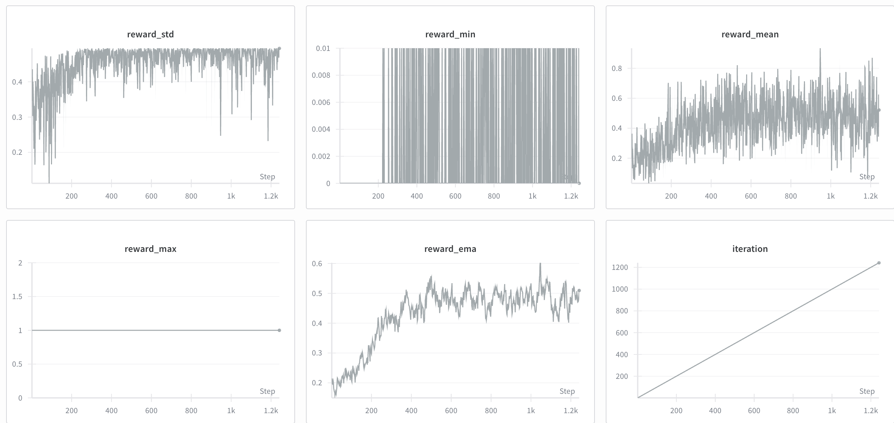

# Fork of tiny-grpo with ES 

This is a minimal repo to implement ES (Evolution Strategies) from the following paper:

[https://arxiv.org/pdf/2509.24372](https://arxiv.org/pdf/2509.24372)

In addition, we fix the reward function of the tiny-grpo repo which [had some bugs](https://x.com/damekdavis/status/1975333022376600047). Most of the code was written quickly by sonnet 4.5 and gpt5.

Follow the twitter discussion [https://x.com/damekdavis/status/1975319985607352420](https://x.com/damekdavis/status/1975319985607352420)



## Setup

I had some llm write a setup script (can you tell?); I can't remember which.

```bash
./setup.sh
source .venv/bin/activate
uv run train_es.py
```

# Minimal GRPO implementation

Goal: Working toy implementation of llama-3.2-3b locally RL training with GRPO. Understanding the algorithm & hyper parameters. Just running everything locally on a single node.

### Setup

1. Create conda env

```
conda create --name grpo python=3.12 -y
conda activate grpo
```

2. Install dependencies

```
pip install -r requirements.txt
pip install flash-attn --no-build-isolation
```

3. Play with the source in `train.py`

```
python train.py
```

### Inspiration

- [OpenRLHF](https://github.com/OpenRLHF/OpenRLHF)
- [Spinning Up in Deep RL](https://spinningup.openai.com/en/latest/)


### References

- [DeepSeek-R1 tech report](https://github.com/deepseek-ai/DeepSeek-R1/blob/main/DeepSeek_R1.pdf)
- [DeepSeekMath: Pushing the Limits of Mathematical Reasoning in Open Language Models](https://arxiv.org/abs/2402.03300)
